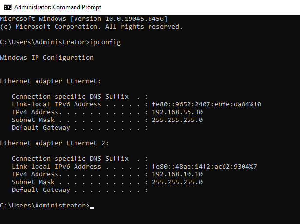
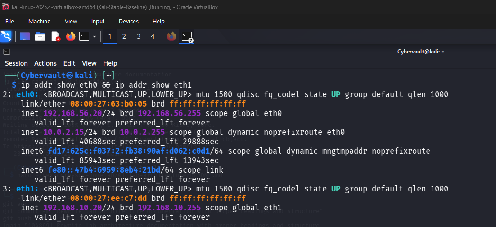
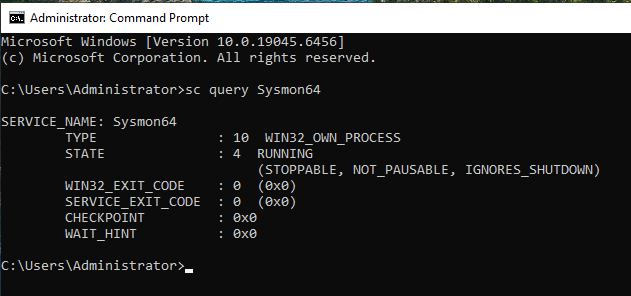
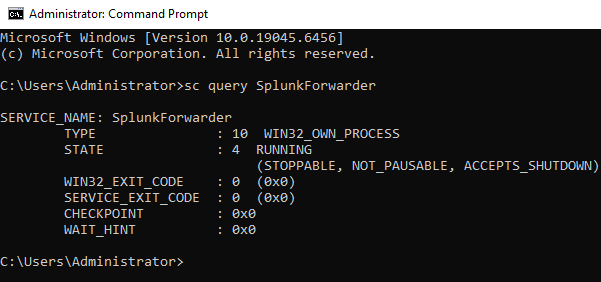
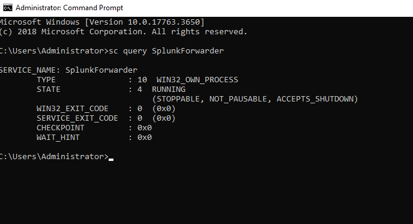
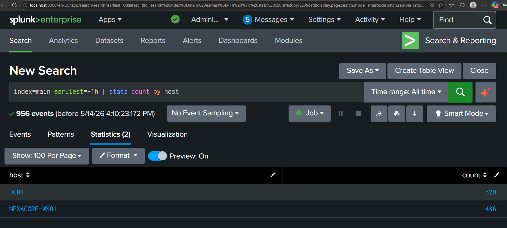

# Infrastructure

## Host Machine

The homelab was built on a Windows laptop running an Intel Core i7 processor with 16GB of RAM, using VirtualBox to host all virtual machines. RAM was allocated based on the role of each machine: Splunk Enterprise on the host uses 4GB, NEXACORE-WS01 was allocated 3GB to run stably with Sysmon and the forwarder running simultaneously, and Kali Linux was allocated 2GB since Linux requires fewer resources.

## Virtual Machines

The lab contains three virtual machines. NEXACORE-WS01 serves as the primary target endpoint, NexaCore-DC01 acts as the Domain Controller managing authentication and Active Directory services for the NexaCore domain, and Kali Linux serves as the attacker machine for simulating real world attacks.

| Machine | Role | Host-Only IP | Internal Network IP |
|---|---|---|---|
| NEXACORE-WS01 | Primary target endpoint | 192.168.56.30 | 192.168.10.10 |
| NexaCore-DC01 | Domain Controller | 192.168.56.10 | 192.168.10.1 |
| Kali Linux | Attacker machine | N/A | 192.168.10.20 |
| Host Laptop | Splunk SIEM | 192.168.56.1 | N/A |

## Network Configuration

Network segmentation was configured using three VirtualBox adapter types. NEXACORE-WS01 and NexaCore-DC01 each use a Host-Only adapter to communicate with Splunk Enterprise on the host laptop at 192.168.56.1, and an Internal Network adapter named NexaCoreNet for isolated communication between lab machines. Kali Linux uses a NAT adapter for internet access to download attack tools and an Internal Network adapter to reach the Windows machines during attack simulations. The Host-Only network uses the 192.168.56.0/24 range while the Internal Network uses 192.168.10.0/24.

**NEXACORE-WS01 network verification:**

The ipconfig command was run on NEXACORE-WS01 to confirm both network adapters were correctly assigned. The output confirms the Host-Only adapter is active at 192.168.56.30, giving the machine a path to Splunk on the host, and the Internal Network adapter is active at 192.168.10.10, connecting it to the other lab machines.

```
ipconfig
```



**NexaCore-DC01 network verification:**

The same command was run on NexaCore-DC01 to verify its adapters. The output confirms the Host-Only adapter is active at 192.168.56.10 and the Internal Network adapter is active at 192.168.10.1, making DC01 reachable by both Splunk and the other lab machines.

```
ipconfig
```


**Kali Linux network verification:**

The ip addr command was run on Kali to confirm both adapters are up. eth0 receives an IP automatically via NAT giving Kali internet access for downloading tools, and eth1 is statically set to 192.168.10.20 so Kali can reach NEXACORE-WS01 and DC01 during attack simulations.

```
ip addr show eth0 && ip addr show eth1
```



## Sysmon

Sysmon was installed on NEXACORE-WS01 to enrich Windows event logs with detailed telemetry including process creation, network connections, PowerShell execution and file system changes. Without Sysmon, Windows logs alone would not provide enough detail for realistic SOC investigation.

The following command was run on NEXACORE-WS01 to confirm Sysmon is installed and running as a service. A state of RUNNING confirms it is actively monitoring and logging endpoint activity.

```
sc query Sysmon64
```



## Splunk Universal Forwarder

The Splunk Universal Forwarder was installed on both NEXACORE-WS01 and NexaCore-DC01 to collect and ship security events to Splunk Enterprise. Logs travel from the endpoints through the forwarder over port 9997 into Splunk where they are indexed, searched and analysed for threat detection and incident investigation.

The following command was run on each machine to confirm the forwarder service is active. A state of RUNNING means the forwarder is collecting logs and sending them to Splunk at 192.168.56.1.

```
sc query SplunkForwarder
```

**Forwarder confirmed running on NEXACORE-WS01:**



**Forwarder confirmed running on NexaCore-DC01:**



## Log Ingestion Confirmed

With both forwarders running and network connectivity verified, the final confirmation was that Splunk Enterprise was actively receiving logs from both machines. The following SPL search was run in Splunk to count events received from each host in the last hour. Seeing both NEXACORE-WS01 and DC01 returning event counts confirms the full log pipeline is operational end to end.

```
index=main earliest=-1h | stats count by host
```

The results show DC01 sending 520 events and NEXACORE-WS01 sending 436 events.


