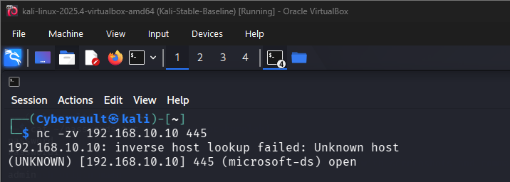
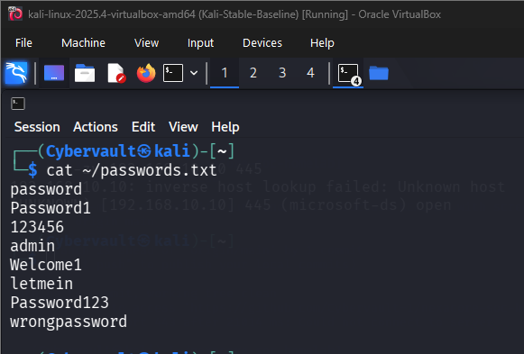
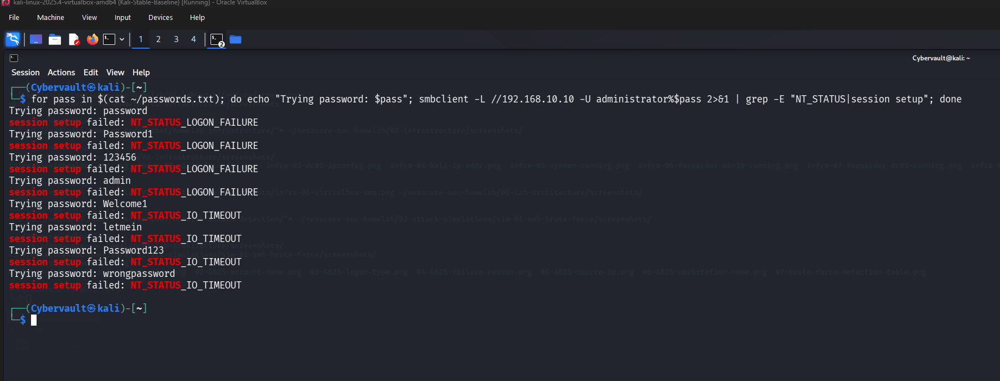
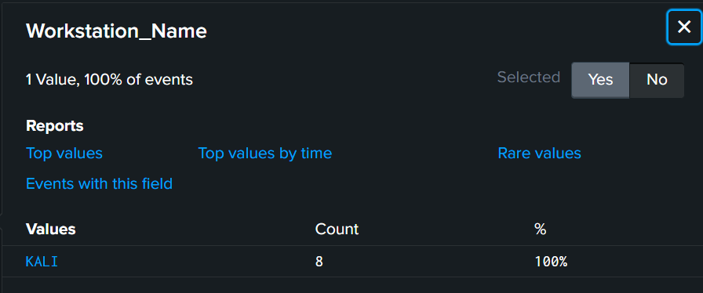

# Attack Simulation 01 — SMB Brute Force

## Objective

The objective of this simulation was to perform a brute force attack against the SMB service on NEXACORE-WS01 using Kali Linux, and to verify that the attack generates detectable evidence in Splunk through Windows Event ID 4625 failed login events.

This simulation demonstrates the full attack and detection chain from reconnaissance through to investigation and remediation recommendations.

## Attack Background

SMB (Server Message Block) is the protocol Windows uses to share files and printers across a network. It runs on port 445 and is one of the most commonly targeted services in real world attacks because it is open by default on most Windows machines.

A brute force attack works by repeatedly trying different passwords against a target account until one succeeds. Every failed attempt generates Windows Security Event ID 4625 which records the source IP, the targeted account, the logon type and the reason for failure.

A sudden spike of 4625 events from the same source IP within a short timeframe is one of the clearest indicators of brute force activity a SOC analyst will encounter.

## MITRE ATT&CK Mapping

| Field | Detail |
|---|---|
| Tactic | Credential Access |
| Technique | Brute Force |
| Sub-technique | T1110.001 — Password Guessing |
| Reference | https://attack.mitre.org/techniques/T1110/001/ |

## Attack Flow Architecture

The attack flows entirely over the Internal Network (NexaCoreNet) using the 192.168.10.0/24 range. Kali Linux initiates the brute force against NEXACORE-WS01 over this isolated network.

Every failed login attempt on NEXACORE-WS01 is captured by Sysmon and the Windows Security log, collected by the Splunk Universal Forwarder, and shipped over the Host-Only network to Splunk Enterprise on the host laptop where the analyst investigates.

```
Kali Linux (192.168.10.20)
        |
        | Brute force attack over Internal Network (port 445)
        |
        v
NEXACORE-WS01 (192.168.10.10) -----> NexaCore-DC01 (192.168.10.1)
        |                              (authentication requests
        |                               forwarded to DC01)
        |
        | Windows Security and Sysmon logs forwarded
        | via Splunk Universal Forwarder (port 9997)
        |
        v
Splunk Enterprise (192.168.56.1) — centralized log monitoring
```

| Role | Machine | IP Address |
|---|---|---|
| Attacker | Kali Linux | 192.168.10.20 |
| Target | NEXACORE-WS01 | 192.168.10.10 |
| Domain Controller | NexaCore-DC01 | 192.168.10.1 |
| SIEM | Splunk Enterprise | 192.168.56.1 |

## Tools Used

- **smbclient** — a Linux command line tool for interacting with Windows SMB shares. Used here inside a bash loop to repeatedly attempt authentication against NEXACORE-WS01 using a custom password list, generating a failed login event on the target for each incorrect password.

## Attack Steps

**Step 1 — Confirm SMB port is open on the target:**

Before launching the attack, netcat was used to verify port 445 was reachable from Kali. Confirming the port is open before attacking is standard attacker reconnaissance — there is no point attempting a brute force if the service is not listening.

```
nc -zv 192.168.10.10 445
```

Expected outcome: if port 445 responds as open, the attacker knows SMB is running and a brute force attempt is viable against this machine.



---

**Step 2 — Create a password list:**

A small custom password list was created on Kali containing common weak passwords.

In a real world attack an adversary would use a much larger wordlist such as rockyou.txt which contains over 14 million commonly used passwords. A small list was used here to keep the simulation clean and the evidence easy to read in Splunk.

```
cat ~/passwords.txt
```

Expected outcome: each password in the list will be tried against the administrator account one by one. Since none of them are the correct password, every attempt will fail and generate an Event ID 4625 in the Windows Security log.



---

**Step 3 — Launch the brute force attack:**

A bash loop was used to pass each password from the list to smbclient, attempting to authenticate as the administrator account on NEXACORE-WS01.

Each failed attempt returned NT_STATUS_LOGON_FAILURE confirming Windows rejected the credentials. All 8 attempts completed in under 2 seconds.

```
for pass in $(cat ~/passwords.txt); do echo "Trying password: $pass"; smbclient -L //192.168.10.10 -U administrator%$pass 2>&1 | grep -E "NT_STATUS|session setup"; done
```

Expected outcome: 8 failed authentication attempts generate 8 Event ID 4625 entries in the Windows Security log on NEXACORE-WS01, all pointing back to Kali at 192.168.10.20 as the source.



## Detection

The attack was detected in Splunk using the following SPL query which searches for failed login events on NEXACORE-WS01 in the last 15 minutes.

```
index=main host=NEXACORE-WS01 EventCode=4625 earliest=-15m
```

The search returned 8 events corresponding exactly to the 8 password attempts made by the attacker.

Under normal circumstances a user mistyping their password would generate 1 or 2 failures. Seeing 8 rapid failures from the same external IP with no successful login is a clear sign of automated brute force activity and would be escalated immediately in a production SOC environment.


## Investigation Findings

Each of the 8 Event ID 4625 events was expanded in Splunk and the following fields were examined to build a complete picture of the attack.

Event ID 4625 is the Windows Security log entry for a failed logon attempt. It captures who was targeted, where the attempt came from, and how the authentication was attempted.

| Field | Value | Event ID | Impact |
|---|---|---|---|
| Account_Name | administrator | 4625 | The attacker targeted the most privileged account on the machine. Compromising administrator gives full control of the system which is why it is the most common brute force target |
| Logon_Type | 3 — Network | 4625 | The attempt came remotely over the network. Any repeated Logon_Type 3 failures from an unfamiliar IP should be treated as suspicious and investigated immediately |
| Failure_Reason | Unknown user name or bad password | 4625 | The same failure reason repeated 8 times from one IP with no success is a textbook brute force pattern. A genuine user mistake rarely exceeds 2 or 3 attempts |
| Source_Network_Address | 192.168.10.20 | 4625 | This is the Kali Linux attacker IP. In a production environment this IP would be immediately blocked, traced and checked against threat intelligence feeds |
| Workstation_Name | KALI | 4625 | The attacker machine name provides a second piece of evidence confirming the source alongside the IP address |

---

The Account_Name field (Event ID 4625) confirms the attacker targeted the administrator account. Analyst next step: check whether the administrator account made any successful logins around the same time, which would indicate the brute force succeeded.


---

The Logon_Type field shows a value of 3 meaning the attempt came over the network from a remote machine. Analyst next step: check whether the same source IP attempted connections to any other machines or ports in the environment.


---

The Failure_Reason field shows Unknown user name or bad password on every single attempt. Seeing this repeated 8 times rapidly from the same source IP with no successful login is a clear indicator of automated brute force activity rather than a genuine user mistake.


---

The Source_Network_Address field (Event ID 4625) shows 192.168.10.20 which is the Kali Linux attacker machine. Analyst next step: isolate this IP immediately, review all events originating from it across the entire environment and check for any successful authentications.


---

The Workstation_Name field shows KALI confirming the attacker machine name. Combined with the source IP this gives the analyst two independent pieces of evidence pointing to the same attacker machine, strengthening the case for escalation and response.



---

The complete detection table showing all five fields across all 8 events was generated using the following query:

```
index=main EventCode=4625 Source_Network_Address=192.168.10.20 earliest=-15m | table _time, Account_Name, Logon_Type, Failure_Reason, Source_Network_Address, Workstation_Name
```


## Remediation and Prevention

**Implement account lockout policy**

Configure Windows to lock an account after 5 failed login attempts within 10 minutes. This directly stops brute force attacks by making automated password guessing impractical.

In this simulation the attacker made 8 attempts with no lockout triggered because no policy was configured, highlighting this as a critical gap.

**Restrict SMB access with firewall rules**

Port 445 should only be reachable by machines that legitimately need SMB access. In this simulation Kali was able to reach port 445 on NEXACORE-WS01 freely across the Internal Network.

A host firewall rule blocking SMB from unknown sources would have prevented the attack entirely.

**Disable SMB where not needed**

If file sharing is not required on a machine disable SMB entirely to remove the attack surface. Many Windows workstations have SMB enabled by default but never actually use it.

**Rename or disable the built-in Administrator account**

The attacker specifically targeted the administrator account because it exists by default on every Windows machine. Renaming it to something non-obvious forces the attacker to guess both the username and the password, significantly increasing the difficulty.

**Use strong unique passwords**

All accounts especially privileged ones should use long complex passwords not found in common wordlists. Every password in the test list such as Password1 and Welcome1 are in the top 1000 most commonly used passwords and would be cracked instantly by a real attacker using rockyou.txt.

**Create a Splunk alert for Event ID 4625**

Configure an automated alert that fires when more than 5 Event ID 4625 failures occur from the same source IP within 5 minutes. This gives the SOC team real time visibility of brute force activity before an attacker succeeds.
