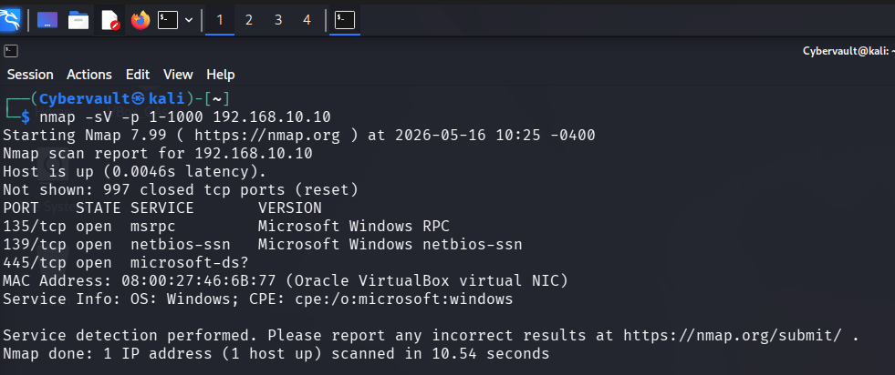
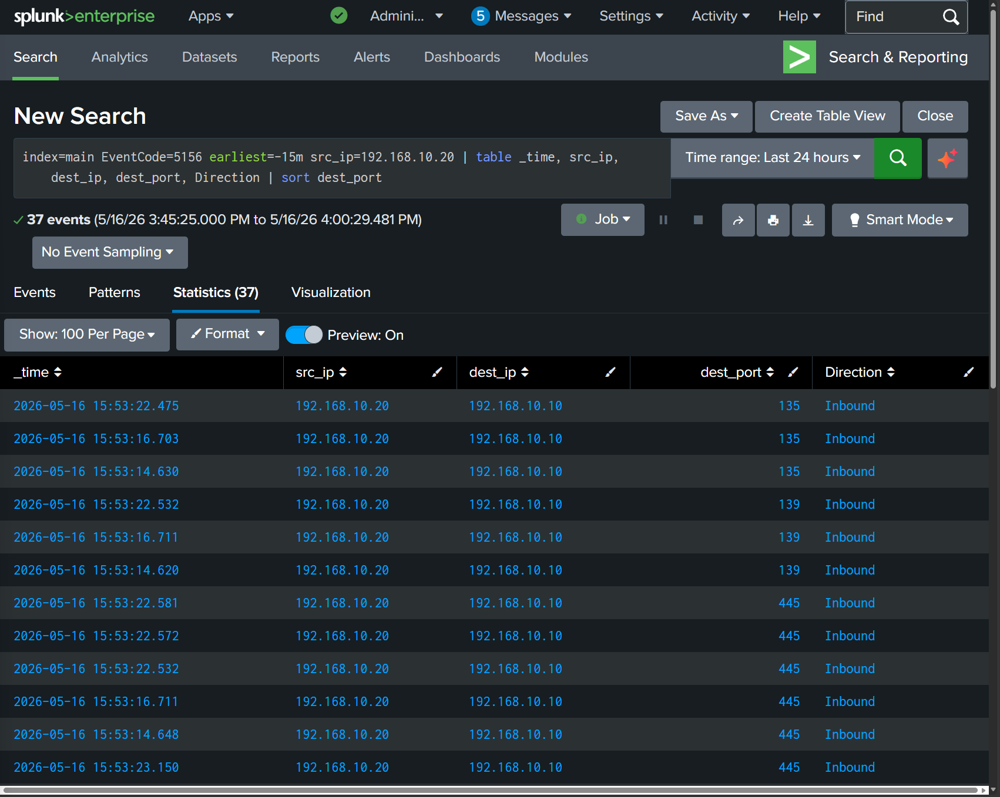
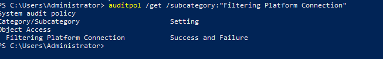
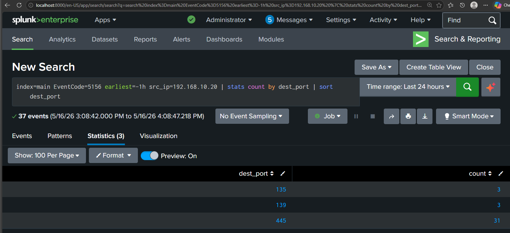

# Simulation 02 — Nmap Reconnaissance

## Overview

This simulation replicates the reconnaissance phase of a real attack. Before an attacker launches any exploit, they first scan the target network to discover open ports and running services. This intelligence tells them which attack paths are available and what vulnerabilities to look for.

This technique maps to MITRE ATT&CK T1046 — Network Service Discovery.

## Attack Details

| Field | Value |
|---|---|
| Attack Type | Network Port Scan |
| Tool Used | Nmap 7.99 |
| Attacker Machine | Kali Linux |
| Attacker IP | 192.168.10.20 |
| Target Machine | NEXACORE-WS01 |
| Target IP | 192.168.10.10 |
| Ports Scanned | 1 to 1000 |
| MITRE Technique | T1046 — Network Service Discovery |
| Date | 16 May 2026 |

## Attack Execution

The following command was run from Kali Linux to scan the target endpoint for open ports and identify running services:

```bash
nmap -sV -p 1-1000 192.168.10.10
```

The `-sV` flag instructs Nmap to probe each open port and identify the exact service and version running on it. The `-p 1-1000` flag limits the scan to the first 1000 ports.

## Scan Results

Nmap discovered three open ports on NEXACORE-WS01:

| Port | State | Service |
|---|---|---|
| 135/tcp | Open | Microsoft Windows RPC |
| 139/tcp | Open | Microsoft Windows NetBIOS |
| 445/tcp | Open | Microsoft SMB |

Port 445 being open is significant. This is the same port targeted in Simulation 01 — SMB Brute Force. A real attacker discovering port 445 open would immediately consider brute force or lateral movement techniques against SMB. This connects the two simulations into a realistic attack chain: reconnaissance leading directly into credential attack.

## Detection Method

Sysmon Event ID 3 does not capture inbound scans because it only logs connections initiated by processes on the Windows machine itself. To detect an inbound Nmap scan, Windows Filtering Platform auditing was enabled using the following command on NEXACORE-WS01:

```powershell
auditpol /set /subcategory:"Filtering Platform Connection" /success:enable /failure:enable
```

This writes Event ID 5156 to the Windows Security event log every time the firewall permits an inbound connection. The Splunk Universal Forwarder then ships these events to Splunk for detection.

## Splunk Detection Query

```spl
index=main EventCode=5156 src_ip=192.168.10.20 | table _time, src_ip, dest_ip, dest_port, Direction | sort dest_port
```

## Evidence

Splunk captured 37 Event ID 5156 entries from Kali's IP address during the scan window. Port 445 received 31 connection attempts, port 135 received 3, and port 139 received 3. The repeated probing of the same ports from a single source IP within seconds is the detection fingerprint of an Nmap service version scan.

## Screenshots

**Nmap scan output from Kali:**



**Splunk detection showing inbound connections from Kali:**



**Audit policy confirming Event ID 5156 logging enabled:**



**Port hit summary showing reconnaissance fingerprint:**


