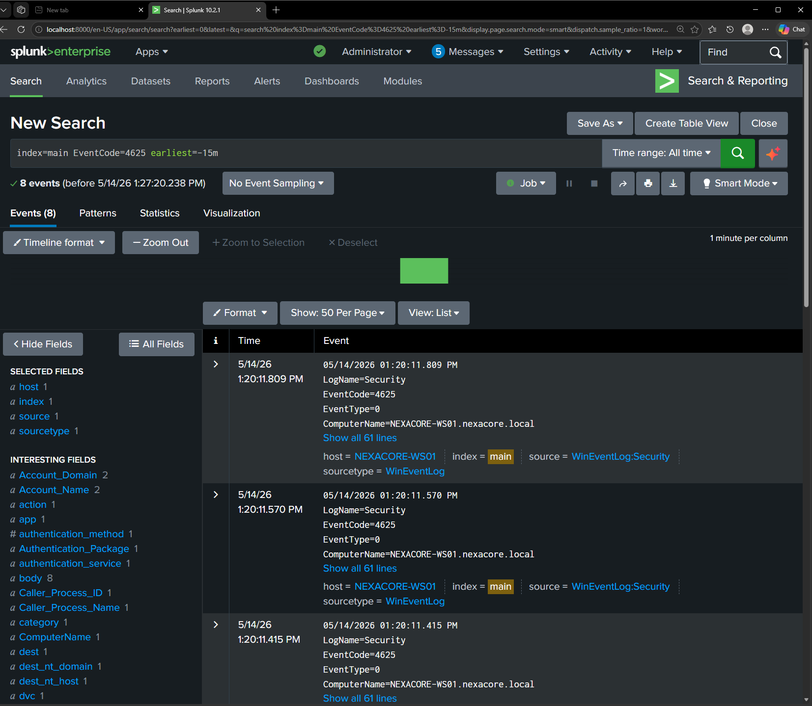

# Incident Report — IR-001: SMB Brute Force Attack

**Date:** 15 May 2026
**Analyst:** Adedeji Adetayo
**Severity:** High
**Status:** Resolved

---

## Executive Summary

On 15 May 2026 an unauthorised machine attempted to gain access to the NexaCore employee workstation by repeatedly trying common passwords against the administrator account. All 8 attempts failed and no accounts or systems were compromised. The attack was detected through Splunk monitoring, the source IP was identified and remediation steps have been implemented including firewall restrictions and automated alerting to prevent recurrence.

---

## Incident Details

| Field | Detail |
|---|---|
| Incident ID | IR-001 |
| Date and Time | 15 May 2026, 17:57:38 to 17:57:40 |
| Attack Type | SMB Brute Force |
| MITRE ATT&CK | T1110.001 — Password Guessing |
| Attacker IP | 192.168.10.20 |
| Attacker Machine | KALI |
| Target Machine | NEXACORE-WS01 |
| Target Account | administrator |
| Total Attempts | 8 |
| Successful Logins | 0 |
| Systems Compromised | None |

---

## Timeline of Events

| Time | Event |
|---|---|
| 17:57:38.423 | First failed login attempt detected on NEXACORE-WS01 |
| 17:57:38.736 | Second failed attempt from 192.168.10.20 |
| 17:57:38.899 | Third failed attempt |
| 17:57:39.145 | Fourth failed attempt |
| 17:57:39.383 | Fifth failed attempt |
| 17:57:39.580 | Sixth failed attempt |
| 17:57:39.846 | Seventh failed attempt |
| 17:57:40.076 | Eighth and final failed attempt |
| Post-attack | Attack detected in Splunk via Event ID 4625 monitoring |
| Post-attack | Source IP identified, investigation completed, remediation applied |

---

## Affected Systems

| Machine | Role | Impact |
|---|---|---|
| NEXACORE-WS01 | Primary target endpoint | Targeted but not compromised |
| NexaCore-DC01 | Domain Controller | Authentication requests forwarded, no compromise |
| Splunk Enterprise | SIEM | Successfully detected the attack |

---

## Attack Description

The attacker used a tool called smbclient to repeatedly attempt authentication against the administrator account on NEXACORE-WS01 over the SMB protocol on port 445. A custom list of commonly used weak passwords was cycled through in rapid succession, with all 8 attempts completing within 2 seconds. This speed and pattern is characteristic of automated brute force tooling rather than a human manually typing passwords.

The attack exploited two security gaps. First, no account lockout policy was configured on NEXACORE-WS01, meaning Windows allowed unlimited failed login attempts without locking the account. Second, port 445 was accessible from the attacker machine without any firewall restriction, giving the attacker unrestricted access to the SMB service.

---

## Detection

The attack was detected in Splunk using the following SPL query which monitors for failed login events on NEXACORE-WS01:

    index=main host=NEXACORE-WS01 EventCode=4625 earliest=-15m

The query returned 8 Event ID 4625 entries, all originating from 192.168.10.20 within a 2 second window. The rapid succession of failures from a single source IP with no successful login confirmed automated brute force activity.

---

## Investigation Findings

The following fields were examined across all 8 Event ID 4625 entries to confirm the nature and scope of the attack:

| Field | Value | Significance |
|---|---|---|
| Account_Name | administrator | The most privileged account on the machine was targeted |
| Logon_Type | 3 — Network | Confirms the attack came remotely over the network |
| Failure_Reason | Unknown user name or bad password | Wrong password on every attempt confirming brute force |
| Source_Network_Address | 192.168.10.20 | Identifies the attacker machine |
| Workstation_Name | KALI | Confirms the name of the attacker machine |

No successful logins were recorded from 192.168.10.20 at any point before, during or after the attack window. The administrator account was not compromised.

---

## Root Cause

The attack was possible due to two misconfigurations on NEXACORE-WS01:

**No account lockout policy** — Windows was configured to allow unlimited failed login attempts. A proper lockout policy would have stopped the attack after 5 failed attempts.

**Unrestricted SMB access** — Port 445 was reachable from the attacker machine without any firewall restriction. Limiting SMB access to only authorised machines would have prevented the connection entirely.

---

## Remediation Actions Taken

**Account lockout policy** — Configure Windows to lock the administrator account after 5 failed login attempts within 10 minutes, making automated brute force attacks impractical.

**Firewall rules** — Restrict access to port 445 so only machines that legitimately require SMB access can reach NEXACORE-WS01.

**Splunk alert created** — A scheduled alert has been configured to fire automatically when more than 5 Event ID 4625 failures are detected from the same source IP within 5 minutes, ensuring future attacks are caught in real time.

**Administrator account hardening** — The built-in administrator account should be renamed to a non-obvious name to prevent attackers from knowing which account to target.

---

## Lessons Learned

This incident highlighted that even a failed attack reveals important security gaps. The attacker was unable to gain access but the absence of an account lockout policy meant they could attempt as many passwords as they wanted without consequence. In a real enterprise environment with a larger password list this attack could have succeeded.

Detection through Splunk was effective. The 8 failed logins were identified immediately using Event ID 4625 monitoring and the attacker IP was traced within minutes of the attack completing. This confirms the value of proper audit policy configuration and centralised log monitoring.

---

## References

- [Attack Simulation Write-up](../../03-attack-simulations/sim-01-smb-brute-force/README.md)
- [Detection Write-up](../../04-detections/detection-01-brute-force/README.md)
- [MITRE ATT&CK T1110.001](https://attack.mitre.org/techniques/T1110/001/)
