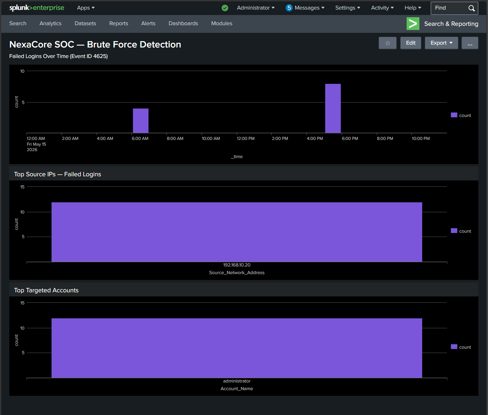

# Dashboard 01 — Brute Force Detection

## Overview

This dashboard monitors failed authentication activity across the NexaCore environment. It was built to provide real-time visibility into brute force attempts targeting Windows accounts and to surface attacker behaviour patterns that would require immediate investigation.

## Dashboard Panels

### Panel 1 — Failed Logins Over Time (Event ID 4625)

Displays failed login attempts grouped by hour across a 24-hour window. This panel is designed to surface attack patterns over time rather than individual events. A single failed login is noise. Multiple failed logins clustered within a short time window is a signal worth investigating.

**SPL Query:** index=main EventCode=4625 earliest=-1d@d latest=@d | timechart span=1h count

### Panel 2 — Top Source IPs Generating Failed Logins

Ranks source IP addresses by total failed login count. In a real SOC environment this panel would immediately surface an attacker IP attempting authentication against multiple accounts or the same account repeatedly. A single IP responsible for all failed logins is a strong indicator of brute force activity.

**SPL Query:** index=main EventCode=4625 earliest=-1d@d latest=@d | stats count by Source_Network_Address | sort -count

### Panel 3 — Top Targeted Accounts

Shows which accounts are being targeted most frequently. Attackers commonly target high-privilege accounts like administrator because a successful compromise gives them full system access.

**SPL Query:** index=main EventCode=4625 earliest=-1d@d latest=@d | stats count by Account_Name | search Account_Name=administrator

## What This Dashboard Detected

| Panel | Finding |
|---|---|
| Failed Logins Over Time | Two attack clusters detected at 06:38 and 17:57 on 15 May 2026 |
| Top Source IPs | Single attacker IP 192.168.10.20 responsible for all 12 failed logins |
| Top Targeted Accounts | Administrator account targeted across both attack sessions |

## MITRE ATT&CK Mapping

| Technique | ID | Description |
|---|---|---|
| Brute Force: Password Guessing | T1110.001 | Repeated failed authentication attempts against administrator account |

## Dashboard Screenshot

