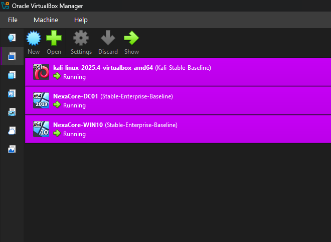

# NexaCore SOC Homelab

---

## About Me

My name is Adedeji Adetayo and I am an aspiring SOC analyst building hands-on experience by designing and operating a cybersecurity homelab from scratch. My goal is to develop practical detection and investigation skills that translate directly into a SOC role.

---

## Lab Overview

The NexaCore SOC Homelab is a fully functional security operations environment built on VirtualBox. It simulates a small enterprise network with a Domain Controller, a target endpoint, and an attacker machine. Splunk Enterprise serves as the central SIEM, collecting logs from all machines and providing real time visibility into attack activity.

The lab is designed around a complete SOC workflow: build the environment, simulate attacks, detect them in Splunk, investigate the evidence, and document findings in a structured incident report.

---

## Lab Architecture

| Machine | Role | Host-Only IP | Internal Network IP |
|---|---|---|---|
| Host Laptop | Splunk SIEM | 192.168.56.1 | N/A |
| NEXACORE-WS01 | Primary target endpoint | 192.168.56.30 | 192.168.10.10 |
| NexaCore-DC01 | Domain Controller | 192.168.56.10 | 192.168.10.1 |
| Kali Linux | Attacker machine | N/A | 192.168.10.20 |

---

## Tools and Technologies

- Splunk Enterprise
- Splunk Universal Forwarder
- Sysmon
- Kali Linux
- Windows 10
- Windows Server 2019
- VirtualBox

---

## Skills Demonstrated

- Attack simulation and threat detection
- Windows event log analysis
- SIEM log ingestion and SPL querying
- Incident investigation and reporting
- Network segmentation and lab architecture design

---

## Lab Documentation

| Section | Description | Link |
|---|---|---|
| Lab Architecture | Network design, VM roles and IP addressing | [View](01-lab-architecture/README.md) |
| Infrastructure | Host specs, VM configuration, Sysmon and Splunk setup | [View](02-infrastructure/README.md) |
| Attack Simulations | Simulated attacks with full evidence chain | [View](03-attack-simulations/sim-01-smb-brute-force/README.md) |
| Detections | SPL queries and detection logic | [View](04-detections/detection-01-brute-force/README.md) |
| Incident Reports | Full IR reports for each simulated attack | [View](05-incident-reports/IR-001-smb-brute-force/README.md) |

---

## Attack and Detection Coverage

| Attack Simulation | MITRE Technique | Detection Method | Status |
|---|---|---|---|
| SMB Brute Force | T1110.001 — Password Guessing | Event ID 4625 via Splunk | Completed |

---

## Certifications

- Google Cybersecurity Certificate

---

## Status

Project currently under active development with ongoing attack simulations, detection engineering, and incident response scenarios.
