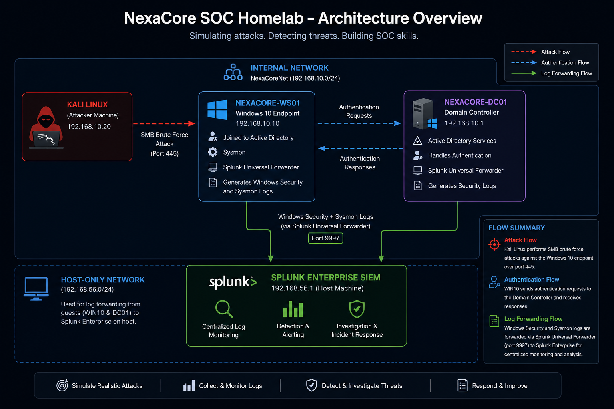

# NexaCore SOC Homelab




---

## About Me

Aspiring SOC analyst building hands-on experience in threat detection, log analysis, and incident investigation through practical cybersecurity homelab projects.

---

## Lab Overview

The NexaCore SOC Homelab is a fully functional security operations environment built on VirtualBox. It simulates a small enterprise network with a Domain Controller, a target Windows endpoint, and a Kali Linux attacker machine.

Splunk Enterprise serves as the central SIEM, collecting logs from all machines and providing real time visibility into attack activity. The lab follows a complete SOC workflow: build the environment, simulate attacks, detect them in Splunk, investigate the evidence, and document findings in structured incident reports.

---

## Lab Architecture

| Machine | Role | OS | RAM | Adapter 1 | Adapter 2 | Internal IP |
|---|---|---|---|---|---|---|
| Host Laptop | Splunk SIEM | Windows 10 | 4GB allocated | N/A | N/A | 192.168.56.1 |
| NEXACORE-WS01 | Target Endpoint | Windows 10 | 3GB | Host-Only | Internal Network | 192.168.10.10 |
| NexaCore-DC01 | Domain Controller | Windows Server 2019 | 4GB | Host-Only | Internal Network | 192.168.10.1 |
| Kali Linux | Attacker | Kali Linux 2025 | 2GB | NAT | Internal Network | 192.168.10.20 |

---

## Tools and Technologies

- Splunk Enterprise
- Splunk Universal Forwarder
- Sysmon
- Kali Linux
- Windows 10
- Windows Server 2019
- VirtualBox

---

## Skills Demonstrated

- Attack simulation and threat detection
- Windows event log analysis
- SIEM log ingestion and SPL querying
- Incident investigation and reporting
- Network segmentation and lab architecture design
- Detection engineering and alert creation

---

## Detection Workflow

Every attack simulation in this lab follows the same structured SOC workflow:

```
Attack Simulation
        |
        | Kali Linux executes attack against target endpoint
        |
        v
Log Generation
        |
        | Sysmon and Windows Security logs capture activity
        |
        v
Log Forwarding
        |
        | Splunk Universal Forwarder ships logs to Splunk (port 9997)
        |
        v
Detection
        |
        | SPL queries identify suspicious patterns in Splunk
        |
        v
Investigation
        |
        | Analyst examines event fields to build attack timeline
        |
        v
Incident Report
        |
        | Findings documented with evidence, MITRE mapping and remediation
```

---

## Lab Documentation

| Section | Description | Link |
|---|---|---|
| Lab Architecture | Network design, VM roles and IP addressing | [View](01-lab-architecture/README.md) |
| Infrastructure | Host specs, VM configuration, Sysmon and Splunk setup | [View](02-infrastructure/README.md) |
| Attack Simulations | Simulated attacks with full evidence chain | [View](03-attack-simulations/sim-01-smb-brute-force/README.md) |
| Detections | SPL queries and detection logic | [View](04-detections/detection-01-brute-force/README.md) |
| Incident Reports | Full IR reports for each simulated attack | [View](05-incident-reports/IR-001-smb-brute-force/README.md) |
| Dashboards | Splunk dashboards for real time threat monitoring | [View](06-dashboards/dashboard-01-brute-force-detection/README.md) |

---

## Attack and Detection Coverage

| Attack Simulation | MITRE Technique | Detection Method | Incident Report | Status |
|---|---|---|---|---|
| [SMB Brute Force](03-attack-simulations/sim-01-smb-brute-force/README.md) | T1110.001 — Password Guessing | Event ID 4625 via Splunk | [IR-001](05-incident-reports/IR-001-smb-brute-force/README.md) | Completed |
| [Nmap Reconnaissance](03-attack-simulations/sim-02-nmap-reconnaissance/README.md) | T1046 — Network Service Discovery | Event ID 5156 via Splunk | [IR-002](05-incident-reports/IR-002-nmap-reconnaissance/README.md) | Completed |
---

## Certifications

| Certification | Issuer | Status |
|---|---|---|
| [Google Cybersecurity Professional Certificate](https://coursera.org/verify/professional-cert/6WSDVPZVYGEM) | Google via Coursera | Completed |

## Contact

| Platform | Link |
|---|---|
| LinkedIn | [Adetayo Adedeji](https://www.linkedin.com/in/adetayo-adedeji-473816337/) |
| Email | Adedejiadetayo33@gmail.com |

---

## Status

Project currently under active development with ongoing attack simulations, detection engineering, and incident response scenarios.
